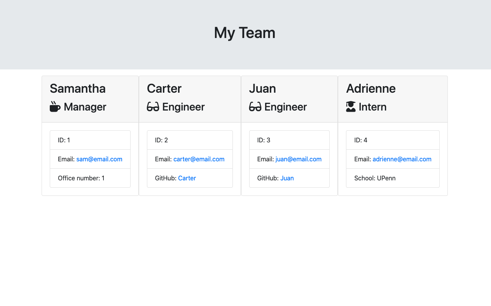
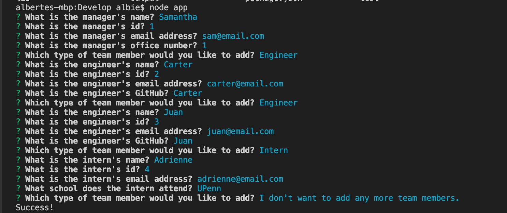

# TeamProfileGenerator

## Description
The Team Profile Generator is a command line application that allows the user to build a software engineering team. The team can only have 1 manager but can have as many engineers and interns as desired. This application outputs am HTML file with a nicely displayed team roster based on information that the user provided. This provides quick access to emails and GitHub profiles of all team members. Please follow this link to view a demonstration of the application- https://drive.google.com/file/d/1_tPYvgYTG9Pog7Nnqi9x3yYE5yrgz2Qu/view 

## Installation
```npm install```

## License
[](https://opensource.org/licenses/MIT)

## Questions
Please contact alberte.laventure@gmail.com with any questions

## Images


